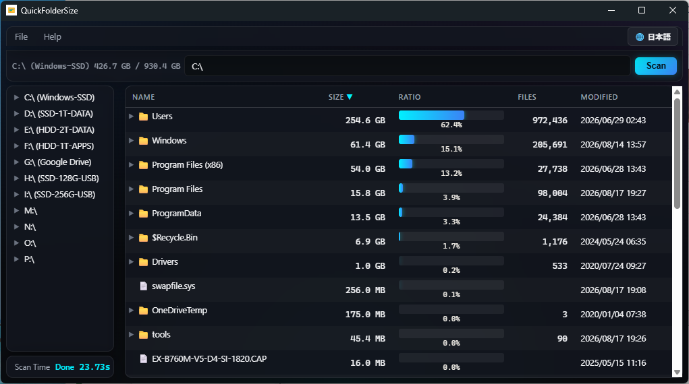

# QuickFolderSize

<p align="center">
  
</p>

Windows desktop app that shows how much space folders and files use on local drives. Scan a path, browse the result as a sortable tree with ratio bars, and export a Markdown report.

Version: **v2.1.1**

Implementation: **C++17 (MinGW-w64 / g++) + WebView2**. The UI is HTML/CSS/vanilla JS hosted in a native WebView2 window. There is no Python or Qt runtime in the shipped app.

## Using the binary release

If you only want to run the app, download the ZIP from GitHub Releases.

- [Latest releases](https://github.com/maktak-105/QuickFolderSize/releases)
- [v2.0.1](https://github.com/maktak-105/QuickFolderSize/releases/tag/v2.0.1)
- [Direct download of QuickFolderSize-binary.zip](https://github.com/maktak-105/QuickFolderSize/releases/download/v2.0.1/QuickFolderSize-binary.zip)

Extract every file into the same folder and run `QuickFolderSize.exe`.

- `QuickFolderSize.exe` — app (bundled UI is embedded in the EXE)
- `QuickFolderSize_cli.exe` — optional CLI build; see [CLI](#cli) below
- `WebView2Loader.dll` — WebView2 loader (required by `QuickFolderSize.exe`)
- `readme.txt` / `readme_jp.txt` — usage notes
- `LICENSE.txt` / `LICENSE_jp.txt` — MIT License

Windows 11 already includes WebView2 Runtime. On some Windows 10 / LTSC / Server machines, install Microsoft Edge WebView2 Runtime (Evergreen).

Updates go through pull requests to `main`. Pushing a `v*` tag (or running the Release workflow) rebuilds the ZIP and attaches it to the GitHub Release.

## Features

- Recursive folder scan with sizes, recursive file counts, and last-modified times
- Background scan (UI stays responsive)
- Full-depth parallel scan: one shared 32-worker pool, non-blocking fan-out, so deep trees stay parallel
- NTFS volume-root fast path: rebuilds the tree from NTFS MFT records instead of walking every directory
- The EXE requests administrator rights at startup (UAC) so the MFT path is available by default
- Automatic Win32 API fallback for non-NTFS volumes, individual folders, or network paths
- Incremental tree updates as each top-level child finishes
- Placeholder row for the first level as soon as a scan starts
- Elapsed scan time in the left-bottom card, updated every 0.2 s (`0.00s` … `12.34s`)
- Drive usage on the address bar (`C:\ 150.3 GB / 512.0 GB`)
- Left nav pane: drives and lazy-expanded folders
- Clicking a path already inside the current scan jumps the tree without rescanning
- NTFS junctions / mount points / reparse points are skipped (no cycles, no other volumes)
- mtime cache: unchanged directories skip re-enumeration on rescan (`FILETIME` compare)
- Folder-size report, exported as Markdown or JSON (same schema as the [CLI](#cli))
- Japanese / English toggle (menu bar, top right). Menus, headers, dialogs, and reports switch immediately
- Optional CLI build (`QuickFolderSize_cli.exe`) that prints scan results as JSON for scripts and AI agents — see [CLI](#cli)

## UI

Dark glassmorphism theme (same family as QuickDiskBench):

- Near-black canvas (`#0a0c10`) with soft blue / purple / cyan radial glows
- Frosted glass cards (`backdrop-filter` blur, translucent `#10141c`)
- Accent cyan `#00f0ff` and blue `#3b82f6` on the Scan button, hover states, and size bars
- Inaccessible folders shown in red (`#ef4444`)
- System fonts only (Segoe UI / Yu Gothic UI) so the UI works offline — no CDN

Layout:

```
┌─ File / Help ──────────────────────────────────── [🌐 English] ─┐
├─ [C:\ 150.3 GB / 512.0 GB]  [path input]  [Scan] ───────────────┤
├─ Drives / folders (lazy) ─┬─ Name | Size | Ratio | Files | Date ┤
│                            │  📁 Windows   40.1 GB  ████  62.3% │
│  Scan Time        2.34s    │  📄 pagefile  16.0 GB  ██    24.9% │
└────────────────────────────┴────────────────────────────────────┘
```

- **File** — Open Folder (`Ctrl+O`), Rescan (`F5`), Export Report as Markdown (`Ctrl+Shift+S`), Export Report as JSON, Exit (`Ctrl+Q`)
- **Help** — About
- **Language button** — Japanese ⇔ English
- **Address bar** — drive capacity, path, Scan (Enter also starts a scan)
- **Left nav** — drive list; expand on demand
- **Scan Time** — live elapsed time while scanning, final time when done
- **Result tree** — click a column header to sort; ▶ / ▼ to expand rows

## Run the built app

```text
dist\binary\QuickFolderSize.exe
```

Keep these files in the **same folder**:

| File | Role |
|------|------|
| `QuickFolderSize.exe` | Native host + scan engine (statically linked), UI bundle embedded as a resource |
| `WebView2Loader.dll` | WebView2 loader |

Windows 11 already includes **Microsoft Edge WebView2 Runtime**. On some Windows 10 / LTSC / Server machines, install the Evergreen Runtime if the window fails to open. See `QuickFolderSize_debug.log` next to the EXE if startup fails.

### NTFS fast scanning

When scanning a volume root such as `C:\`, QuickFolderSize uses an NTFS Master File Table (MFT) fast path. The executable requests administrator rights at startup, so Windows displays a UAC confirmation. It reads NTFS file records and reconstructs the tree without opening every directory. Individual folders, exFAT/FAT32 volumes, and network paths use the regular `FindFirstFileW` / `FindNextFileW` scanner instead.

## CLI

`QuickFolderSize_cli.exe` is a standalone console build for scripts and AI agents — no GUI, no WebView2, no companion files. It shares the same scan engine as the GUI.

```text
QuickFolderSize_cli.exe <path> [--pretty] [--version]
```

- Scans `<path>` once (synchronously) and prints one JSON object to **stdout**, UTF-8 encoded, no trailing metadata. On error, prints `{"error": "..."}` to **stderr** and exits non-zero.
- Exit code: `0` on success, `1` if the path doesn't exist / isn't a directory.
- `--pretty` indents the JSON output; the default is a single compact line.
- `--version` prints the CLI version and exits `0`.
- The output schema is identical to the GUI's **Export Report (JSON)** output:

  ```json
  {
    "path": "C:\\Users\\me\\Downloads\\",
    "scanned_at": "2026-08-24T11:48:13",
    "total_size": 1288490188,
    "subfolder_count": 42,
    "file_count_recursive": 1234,
    "tree": {
      "name": "Downloads", "path": "C:\\Users\\me\\Downloads\\",
      "size": 1288490188, "file_count": 1234, "mtime_ms": 1737000000000,
      "is_accessible": true, "is_dir": true,
      "children": [ ]
    }
  }
  ```

- **No administrator manifest.** Unlike the GUI, the CLI does not request elevation, so it never blocks on a UAC prompt — it's safe to call from a non-interactive shell or agent. If it happens to be launched from an already-elevated shell and the target is an NTFS volume root, it automatically benefits from the MFT fast path; otherwise it transparently uses the regular Win32 scanner (same fallback the GUI uses).
- **No cache between runs.** Each invocation is a fresh process, so it always does a full scan — there's no equivalent to the GUI's mtime-based rescan speedup.
- Example: `QuickFolderSize_cli.exe C:\Users\me\Downloads | jq .total_size`

Distribution notes for end users: [`dist/documents/readme.txt`](dist/documents/readme.txt) (English) and [`dist/documents/readme_jp.txt`](dist/documents/readme_jp.txt) (Japanese).

## Build from source

```powershell
winget install --id BrechtSanders.WinLibs.MCF.UCRT --exact --source winget
# Place WebView2 SDK headers/loader at C:\tools\webview2\build\native\
#   include\WebView2.h  and  x64\WebView2Loader.dll

cd QuickFolderSize
build.bat
# → dist\binary\QuickFolderSize.exe
```

`build.bat` runs `python build-tools\build_native.py`. That script finds WinLibs `g++`, bundles the HTML (embedding it into the GUI as an RCDATA resource), compiles the GUI EXE (`-mwindows`, engine statically linked) and the CLI EXE (console subsystem, no administrator manifest), and copies `WebView2Loader.dll`.

Details: [`document/environment.md`](document/environment.md).

## Keyboard shortcuts

| Shortcut | Action |
|----------|--------|
| `Ctrl+O` | Open folder dialog |
| `F5` | Rescan |
| `Ctrl+Shift+S` | Export Markdown report |
| `Ctrl+Q` | Exit |
| `Enter` in the path box | Scan |

## Requirements

- Windows 10 / 11 (64-bit)
- Microsoft Edge WebView2 Runtime
- To **build**: MinGW-w64 g++ (WinLibs MCF/UCRT), WebView2 SDK, Python 3 (for the build scripts only)

No third-party C++ libraries. The frontend is vanilla JS.

## Repository layout

```
QuickFolderSize/
├── core/native/          Scan engine + WebView2 host + CLI entry point (C++)
├── templates/            Dev HTML
├── static/css|js         Dev CSS / JS
├── resources/help/       In-app help / operation manual source (help.md / help_jp.md)
├── python/prototype/     Phase 1 Python/PyQt6 prototype (reference only)
├── document/             Spec, environment, about
├── dist/binary/          Build output (not in git)
├── dist/documents/       Packaged readme / history
├── build-tools/          build_native.py (native build) + bundle_html.py (inlines CSS/JS into one HTML file)
└── build.bat
```

## Docs

- Spec → [document/spec.md](document/spec.md)
- Build environment → [document/environment.md](document/environment.md)
- About / version → [document/about.md](document/about.md)

## Concept

I built this in a pinch: the SSD on my work PC was almost full.

Export the report and feed it to an AI agent — it gives surprisingly useful advice about what to clean up.

Similar tools already exist, but none of them felt right for me, so I wrote one from scratch. After a lot of trial and error with different scan conditions, it runs reasonably fast.

## Author

GitHub: [maktak-105](https://github.com/maktak-105)
