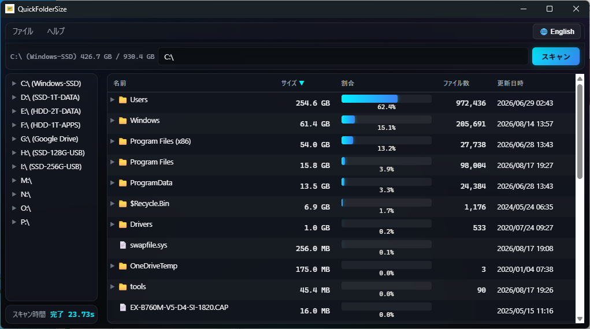

# QuickFolderSize

<p align="center">
  
</p>

ローカルドライブ・フォルダの使用容量を視覚的に把握するための Windows デスクトップアプリです。パスをスキャンし、割合バー付きのソート可能なツリーで結果を表示し、Markdown レポートを出力できます。

バージョン: **v3.0.0**

実装: **C++17（MinGW-w64 / g++）+ WebView2**。UI はネイティブの WebView2 ウィンドウ上の HTML / CSS / バニラ JS です。配布アプリに Python や Qt のランタイムは含まれません。

## 配布版を使う

ソースをビルドしなくてよい場合は、GitHub Releases から ZIP をダウンロードしてください。

- [最新の Release](https://github.com/maktak-105/QuickFolderSize/releases)
- [v3.0.0](https://github.com/maktak-105/QuickFolderSize/releases/tag/v3.0.0)
- [QuickFolderSize-binary.zip を直接ダウンロード](https://github.com/maktak-105/QuickFolderSize/releases/download/v3.0.0/QuickFolderSize-binary.zip)

ZIP を同じフォルダに展開して `QuickFolderSize.exe` を実行します。

- `QuickFolderSize.exe` — 本体(UIはEXEに埋め込み済み)
- `QuickFolderSize_cli.exe` — 任意のCLI版。[CLI](#cli)を参照
- `WebView2Loader.dll` — WebView2 ローダー(`QuickFolderSize.exe`に必須)
- `readme.txt` / `readme_jp.txt` — 使い方
- `mcp-server/` — 任意のMCPサーバー(Node.jsソース、Node.jsと初回の`npm install`が必要)。[MCP サーバー](#mcp-サーバー)を参照
- `mcp_readme.txt` / `mcp_readme_jp.txt` — MCPサーバーの説明書
- `LICENSE.txt` / `LICENSE_jp.txt` — MIT License

### 完全性検証 (SHA-256)

配布用 ZIP および各バイナリの公式 SHA-256 ハッシュ値は、CI (GitHub Actions) ビルド時に自動計算され、各リリースページに `SHA256SUMS.txt` として添付・公開されています。PowerShell でダウンロードファイルの完全性を確認できます:

```powershell
Get-FileHash .\QuickFolderSize-binary.zip -Algorithm SHA256
```

Windows 11 には WebView2 Runtime が標準搭載です。一部の Windows 10 / LTSC / Server では Evergreen Runtime の追加インストールが必要です。

今後の更新は `main` へのプルリクエストで行います。`v*` タグを push するか Release ワークフローを実行すると、GitHub Actions が ZIP をビルドして Release に載せます。

## 主な機能

- 指定フォルダ以下を再帰スキャンし、サイズ・再帰ファイル数・更新日時を集計
- バックグラウンドスキャン（UI をブロックしない）
- 全深度並列スキャン: 共有 32 ワーカープール + 非ブロッキング fan-out。深い階層でも並列度が落ちない
- NTFS ボリューム直下は MFT 高速スキャン。各フォルダを巡回せず、NTFS のファイルレコードからツリーを復元
- MFT利用のためEXEは管理者権限を要求し、起動時にUAC確認を表示
- MFTを利用できない場合（非NTFS、個別フォルダなど）はWin32 APIの汎用スキャンへ自動フォールバック
- ルート直下の子が終わるたびにツリーを順次更新
- スキャン開始と同時に直下 1 レベルをプレースホルダー表示
- 左下のスキャン時間カードに経過秒を表示（0.2 秒ごとに更新、`0.00s` … `12.34s`）
- アドレスバーにドライブ使用量（`C:\ 150.3 GB / 512.0 GB`）
- 左ナビ: ドライブ一覧と遅延展開フォルダ
- スキャン済みツリー内のパスは再スキャンせず即時表示切替
- NTFS ジャンクション / マウントポイント / リパースポイントは再帰から除外
- mtime キャッシュ: 変化のないディレクトリは再列挙をスキップ（`FILETIME` 比較）
- フォルダ容量レポート。Markdown または JSON で出力(スキーマは[CLI](#cli)と共通)
- 日本語 ⇔ English（メニューバー右端）。メニュー・ヘッダー・ダイアログ・レポートが即時切替
- 任意のCLI版(`QuickFolderSize_cli.exe`)。スキャン結果をJSONで標準出力し、スクリプト・AIエージェント向け。[CLI](#cli)を参照
- 任意のMCPサーバー(`mcp-server/`)。Claude CodeのようなAIエージェントがHTTP経由でスキャンを呼び出せる。[MCP サーバー](#mcp-サーバー)を参照

## UI

QuickDiskBench と同じ系統のダーク・グラスモーフィズムです。

- ほぼ黒のキャンバス（`#0a0c10`）に青 / 紫 / シアンの放射グラデーション
- すりガラス風カード（`backdrop-filter` ブラー、半透明 `#10141c`）
- アクセントはシアン `#00f0ff` と青 `#3b82f6`（スキャンボタン、ホバー、サイズバー）
- アクセスできないフォルダは赤（`#ef4444`）
- フォントはシステムのみ（Segoe UI / 游ゴシック UI）。CDN なしでオフラインでも表示できる

画面構成:

```
┌─ ファイル / ヘルプ ────────────────────────────── [🌐 English] ─┐
├─ [C:\ 150.3 GB / 512.0 GB]  [パス入力]  [スキャン] ─────────────┤
├─ ドライブ / フォルダ（遅延）─┬─ 名前 | サイズ | 割合 | 数 | 日時 ─┤
│                              │  📁 Windows   40.1 GB  ████  62.3% │
│  スキャン時間        2.34s   │  📄 pagefile  16.0 GB  ██    24.9% │
└──────────────────────────────┴──────────────────────────────────┘
```

- **ファイル** — フォルダを開く（`Ctrl+O`）、再スキャン（`F5`）、レポート作成 Markdown（`Ctrl+Shift+S`）、レポート作成 JSON、終了（`Ctrl+Q`）
- **ヘルプ** — バージョン情報
- **言語ボタン** — 日本語 ⇔ English
- **アドレスバー** — ドライブ容量、パス、スキャン（Enter でも開始）
- **左ナビ** — ドライブ一覧。展開時に子フォルダをロード
- **スキャン時間** — 実行中は経過秒、完了後は最終時間
- **結果ツリー** — 列ヘッダーでソート、▶ / ▼ で展開

## ビルド済みアプリの起動

```text
dist\binary\QuickFolderSize.exe
```

次のファイルは **同じフォルダ** に置いてください。

| ファイル | 役割 |
|----------|------|
| `QuickFolderSize.exe` | ネイティブホスト + スキャンエンジン（静的リンク）、UIはリソースとして埋め込み済み |
| `WebView2Loader.dll` | WebView2 ローダー |

**Microsoft Edge WebView2 Runtime** は Windows 11 に標準搭載です。一部の Windows 10 / LTSC / Server では、ウィンドウが出ない場合に Evergreen Runtime の追加インストールが必要です。起動に失敗したら EXE と同じ場所の `QuickFolderSize_debug.log` を見てください。

### NTFS 高速スキャンについて

ドライブ直下（例: `C:\`）では、NTFS の MFT（Master File Table）を直接読み取る高速経路を使用します。EXEは起動時に管理者権限を要求します。個別フォルダ、exFAT/FAT32、ネットワークパスでは従来の `FindFirstFileW` / `FindNextFileW` 列挙へ戻ります。

## CLI

`QuickFolderSize_cli.exe` は、スクリプトやAIエージェント向けの単体コンソール版です。GUIもWebView2も不要で、依存ファイルもありません。スキャンエンジンはGUIと共通です。

```text
QuickFolderSize_cli.exe <path> [--pretty] [--version]
```

- `<path>` を1回(同期的に)スキャンし、JSONオブジェクトを1個**標準出力**へUTF-8で出力します(末尾に余計な情報は付きません)。エラー時は`{"error": "..."}`を**標準エラー出力**へ出し、終了コードは非0になります。
- 終了コード: 成功時`0`、パスが存在しない/ディレクトリでない場合`1`。
- `--pretty` でインデント付きの整形出力(既定はコンパクトな1行)。
- `--version` でCLIのバージョンを表示して終了(`0`)。
- 出力スキーマはGUIの**レポート作成(JSON)**と同一です:

  ```json
  {
    "path": "C:\\Users\\me\\Downloads\\",
    "scanned_at": "2026-08-24T11:48:13",
    "total_size": 1288490188,
    "subfolder_count": 42,
    "file_count_recursive": 1234,
    "tree": {
      "name": "Downloads", "path": "C:\\Users\\me\\Downloads\\",
      "size": 1288490188, "file_count": 1234, "mtime_ms": 1737000000000,
      "is_accessible": true, "is_dir": true,
      "children": [ ]
    }
  }
  ```

- **管理者マニフェストを埋め込んでいません。** GUIと違い昇格を要求しないため、UACダイアログで止まりません。非対話シェルやエージェントから安全に呼べます。すでに管理者権限のシェルから起動した場合、対象がNTFSボリューム直下ならMFT高速経路の恩恵を受けます。それ以外は通常のWin32列挙(GUIと同じフォールバック)を使います。
- **実行間のキャッシュはありません。** 1回の起動は独立したプロセスなので毎回フルスキャンになります。GUIのmtimeキャッシュによる再スキャン高速化に相当する機能はありません。
- 例: `QuickFolderSize_cli.exe C:\Users\me\Downloads | jq .total_size`

配布パッケージ向けの説明: [`dist/documents/readme_jp.txt`](dist/documents/readme_jp.txt)（日本語）、[`dist/documents/readme.txt`](dist/documents/readme.txt)（英語）。

## MCP サーバー

`mcp-server/` は `QuickFolderSize_cli.exe` をHTTP経由のMCP(Model Context Protocol)ツールとして公開するNode.js製サイドカーです。Claude CodeのようなAIエージェントが、GUIを開かずスキャン結果を直接取得できます。配布ZIPに同梱されていますが、GUI/CLIと違い自己完結の実行ファイルではなくNode.jsソースなので、利用にはNode.jsのインストールが別途必要です。

```
cd mcp-server
npm install          # 初回のみ
mcp-server\start-admin.bat
```

**管理者権限での起動が必須です。** 非管理者だとCLIがMFT高速経路を使えず低速なWin32列挙にフォールバックし、巨大フォルダのスキャンでシステムに負荷がかかります。起動後は `http://127.0.0.1:39391/mcp` で待ち受けます。

提供ツール: `server_status`(疎通確認)、`scan_folder`(同期スキャン)、`start_scan`/`get_scan_result`(非同期スキャン、大きいフォルダ向け)。詳細・運用上の注意(Claude側ツール呼び出しのタイムアウト回避策など)は [`mcp-server/README.md`](mcp-server/README.md) を参照してください。

### ソースからのビルド
 
```powershell
winget install --id BrechtSanders.WinLibs.MCF.UCRT --exact --source winget
# WebView2 SDK のヘッダ / ローダーを C:\tools\webview2\build\native\ に配置
#   include\WebView2.h  と  x64\WebView2Loader.dll

cd QuickFolderSize
scripts\build.bat
# → dist\QuickFolderSize.exe
```

`scripts\build.bat` は `python scripts\build.py` を呼びます。WinLibs の `g++` を探し、HTML をバンドル(GUIへRCDATAとして埋め込み)し、GUI EXE（`-mwindows`、エンジンは静的リンク）とCLI EXE(コンソールサブシステム、管理者マニフェストなし)をコンパイルし、`WebView2Loader.dll` をコピーします。

詳細は [`docs/environment.md`](docs/environment.md)。

## キーボードショートカット

| ショートカット | 機能 |
|----------------|------|
| `Ctrl+O` | フォルダ選択ダイアログ |
| `F5` | 再スキャン |
| `Ctrl+Shift+S` | Markdown レポート出力 |
| `Ctrl+Q` | 終了 |
| パス欄で `Enter` | スキャン |

## 動作環境

- Windows 10 / 11（64bit）
- Microsoft Edge WebView2 Runtime
- **ビルド時**: MinGW-w64 g++（WinLibs MCF/UCRT）、WebView2 SDK、Python 3（ビルドスクリプト用のみ）

サードパーティの C++ ライブラリは使いません。フロントエンドもフレームワーク非依存です。

## リポジトリ構成

```
QuickFolderSize/
├── src/
│   ├── app/              GUIホスト & Windowsリソース（main_gui.cpp, .rc, .ico, .manifest）
│   ├── cli/              CLIエントリーポイント & CLIリソース（main_cli.cpp, .rc）
│   ├── engine/           フォルダスキャン & MFTエンジン（engine.cpp, engine.h）
│   └── ui/               UIソース（index.html, css/, js/, img/）
├── proto/prototype/      Phase 1 の Python/PyQt6 プロトタイプ（参照用）
├── scripts/              build.py（ビルドスクリプト）, build.bat, bundle_html.py
├── resources/help/       アプリ内ヘルプ・操作説明書の原稿（help.md / help_jp.md）
├── docs/                 仕様・開発環境・バージョン情報
│   └── distribution/     配布用 readme / history / LICENSE
├── dist/                 フラットなビルド成果物（Git 管理外、.gitkeepのみ保持）
├── mcp-server/           CLIをHTTP MCPツールとして公開するNode.jsサイドカー([README](mcp-server/README.md))
└── .github/workflows/    CI / Release ワークフロー
```

## ドキュメント

- 仕様書 → [docs/spec_jp.md](docs/spec_jp.md)
- 開発環境・ビルド手順 → [docs/environment.md](docs/environment.md)
- バージョン情報 → [docs/about.md](docs/about.md)

## コンセプト

仕事で使っている PC の SSD がかつかつで、苦し紛れに作りました。

レポートを AI エージェントに流すと、いい感じでアドバイスをくれます。

同じようなツールはありますが、使い勝手が自分には合わず、一から作ってみました。試行錯誤して条件をいくつも変えたので、そこそこ高速で動くと思います。

## 制作者

GitHub: [maktak-105](https://github.com/maktak-105)
